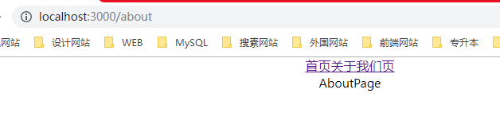

[TOC]


# react-router

>  https://react-router.docschina.org/web/guides/philosophy 

## 安装

```javascript
npm i react-router-dom -S
```

## 使用

+ Route 相当于router-view

### exact

#### 不加exact

**包含式的路由 如果b路由中包含了a路由 则同时显示a组件和b组件**

> 因为"/about"路径包含"/"所以，在关于我们页 也会显示“homePage”这个组件的内容

```javascript
import React from 'react';
// 用于浏览器的router
import { BrowserRouter as Router, Link, Route } from 'react-router-dom'

// 首页组件
function Home(props) {
  return (
    <div>
      HomePage
    </div>
  )
}

// 关于我们页组件
function About(props) {
  return (
    <div>
      AboutPage
    </div>
  )
}

function RouterSample(props) {
  return (
    <div>
      {/*
        路由即组件
         Router 只能有一个子节点
      */}
      <Router>
        <React.Fragment>
          <Link to={"/"}>首页</Link>
          <Link to={"/about"}>关于我们页</Link>
        </React.Fragment>
        {/*
            1、包含式的路由
              -- 因为"/about"路径包含"/"所以，在关于我们页 也会显示homePage
            2、其实 Router 就是 路由插槽
        */}
        <Route path={"/"} component={ Home } />
        <Route path={"/about"} component={ About } />
      </Router>
    </div>
  );
}

export default RouterSample;
```


#### 使用exact

*必须于定义的路径完全一致**

> 就是路径/路由定义的组件是谁 那么就显示谁

```javascript
import React from 'react';
// 用于浏览器的router
import { BrowserRouter as Router, Link, Route } from 'react-router-dom'

// 首页组件
function Home(props) {
  return (
    <div>
      HomePage
    </div>
  )
}

// 关于我们页组件
function About(props) {
  return (
    <div>
      AboutPage
    </div>
  )
}

function RouterSample(props) {
  return (
    <div>
      {/*
        路由即组件
         Router 只能有一个子节点
      */}
      <Router>
        <React.Fragment>
          <Link to={"/"}>首页</Link>
          <Link to={"/about"}>关于我们页</Link>
        </React.Fragment>
        {/*
            1、包含式的路由
              -- 因为"/about"路径包含"/"所以，在关于我们页 也会显示homePage
            2、其实 Router 就是 路由插槽
        */}
        <Route exact path={"/"} component={ Home } />
        <Route path={"/about"} component={ About } />
      </Router>
    </div>
  );
}

export default RouterSample;
```


### Switch

**把一堆Route用Switch包含起来 则从上至下进行匹配 如果有一个匹配项了，则不向下进行匹配**

#### 没有switch

> 因为是包含性的路由匹配机制，所以 404 会出现

```javascript
import React from 'react';
// 用于浏览器的router
import { BrowserRouter as Router, Link, Route, Switch } from 'react-router-dom'

// 首页组件
function Home(props) {
  return (
    <div>
      HomePage
      <h2>课程列表</h2>
      <ul>
        <li>
          {/* parmers 传参 */}
          <Link to={"/details/web"}>Web 架构师</Link>
          <Link to={"/details/Python"}>Python 架构师</Link>
        </li>
      </ul>
    </div>
  )
}

// 详情页
function Details(props) {
  /**
   *  1.history:  命令式导航 指令
         action: "PUSH"
         block:
         createHref:
         go:
         goBack:
         goForward:
         length:
         listen:
         location:
         push:
         replace:
   *  2.location:  获取路径信息
         hash: ""
         key: "hm99ww"
         pathname: "/details/web"
         search: ""
         state: undefined
      3.match: 参数
         isExact: true
         params: {course: "web"}
         path: "/details/:course"
         url: "/details/web"
   */
  console.log(props);
  return (
    <div>
      当前课程 { props.match.params.course }
      <button onClick={ props.history.goBack }>后退</button>
    </div>
  )
}

// 关于我们页组件
function About(props) {
  return (
    <div>
      AboutPage
    </div>
  )
}

// 关于我们页组件
function NoPage(props) {
  return (
    <div>
      404
    </div>
  )
}

function RouterSample(props) {
  return (
    <div>
      {/*
        路由即组件
         Router 只能有一个子节点
      */}
      <Router>
          <React.Fragment>
            <Link to={"/"}>首页</Link>
            <Link to={"/about"}>关于我们页</Link>
          </React.Fragment>
          {/*
            1、包含式的路由
              -- 如果不适用exact 关键字 因为"/about"路径包含"/"所以，在关于我们页 也会显示homePage
            2、其实 Router 就是 路由插槽
        */}
        {/*<Switch>*/}
          <Route exact path={"/"} component={ Home } />
          <Route exact path={"/details/:course"} component={ Details } />
          <Route path={"/about"} component={ About } />
          {/* 404 直接匹配 没有路径 在Switch 包裹的情况下 当其他匹配不到的时候 就会匹配他 */}
          <Route component={ NoPage } />
        {/*</Switch>*/}
      </Router>
    </div>
  );
}

export default RouterSample;
```


#### 使用Switch

> 从上向下匹配 如果已经匹配到了 则不进行匹配了

```javascript
import React from 'react';
// 用于浏览器的router
import { BrowserRouter as Router, Link, Route, Switch } from 'react-router-dom'

// 首页组件
function Home(props) {
  return (
    <div>
      HomePage
      <h2>课程列表</h2>
      <ul>
        <li>
          {/* parmers 传参 */}
          <Link to={"/details/web"}>Web 架构师</Link>
          <Link to={"/details/Python"}>Python 架构师</Link>
        </li>
      </ul>
    </div>
  )
}

// 详情页
function Details(props) {
  console.log(props);
  return (
    <div>
      当前课程 { props.match.params.course }
      <button onClick={ props.history.goBack }>后退</button>
    </div>
  )
}

// 关于我们页组件
function About(props) {
  return (
    <div>
      AboutPage
    </div>
  )
}

// 关于我们页组件
function NoPage(props) {
  return (
    <div>
      404
    </div>
  )
}

function RouterSample(props) {
  return (
    <div>
      {/*
        路由即组件
         Router 只能有一个子节点
      */}
      <Router>
          <React.Fragment>
            <Link to={"/"}>首页</Link>
            <Link to={"/about"}>关于我们页</Link>
          </React.Fragment>
          {/*
            1、包含式的路由
              -- 如果不适用exact 关键字 因为"/about"路径包含"/"所以，在关于我们页 也会显示homePage
            2、其实 Router 就是 路由插槽
        */}
        <Switch>
          <Route exact path={"/"} component={ Home } />
          <Route exact path={"/details/:course"} component={ Details } />
          <Route path={"/about"} component={ About } />
          {/* 404 直接匹配 没有路径 在Switch 包裹的情况下 当其他匹配不到的时候 就会匹配他 */}
          <Route component={ NoPage } />
        </Switch>
      </Router>
    </div>
  );
}

export default RouterSample;
```



### params 传参

```javascript
import React from 'react';
// 用于浏览器的router
import { BrowserRouter as Router, Link, Route } from 'react-router-dom'

// 首页组件
function Home(props) {
  return (
    <div>
      HomePage
      <h2>课程列表</h2>
      <ul>
        <li>
          {/* parmers 传参 */}
          <Link to={"/details/web"}>Web 架构师</Link>
          <Link to={"/details/Python"}>Python 架构师</Link>
        </li>
      </ul>
    </div>
  )
}

// 详情页
function Details(props) {
  console.log(props)
  return (
    <div>
      当前课程 { props.match.params.course }
    </div>
  )
}

// 关于我们页组件
function About(props) {
  return (
    <div>
      AboutPage
    </div>
  )
}

function RouterSample(props) {
  return (
    <div>
      {/*
        路由即组件
         Router 只能有一个子节点
      */}
      <Router>
        <React.Fragment>
          <Link to={"/"}>首页</Link>
          <Link to={"/about"}>关于我们页</Link>
        </React.Fragment>
        {/*
            1、包含式的路由
              -- 如果不适用exact 关键字 因为"/about"路径包含"/"所以，在关于我们页 也会显示homePage
            2、其实 Router 就是 路由插槽
        */}
        <Route exact path={"/"} component={ Home } />
        <Route exact path={"/details/:course"} component={ Details } />
        <Route path={"/about"} component={ About } />
      </Router>
    </div>
  );
}

export default RouterSample;
```

### 路由嵌套

> 通过一个高阶函数强化Route
>
> 1. 做判断是否登录
> 2. 登录就渲染本来就要选择的组件
> 3. 没登陆重定向去登录页面，并把本页面的地址当成参数传递给登录页面
> 4. 登录页面如果监测到登录直接重定向到地址中的上个页面
> 5. 调用方法 进行登录

```javascript
import React from 'react';
// 用于浏览器的router
import { BrowserRouter as Router, Link, Route, Switch } from 'react-router-dom'

// 首页组件
function Home(props) {
  return (
    <div>
      HomePage
      <h2>课程列表</h2>
      <ul>
        <li>
          {/* parmers 传参 */}
          <Link to={"/details/web"}>Web 架构师</Link>
          <Link to={"/details/Python"}>Python 架构师</Link>
        </li>
      </ul>
    </div>
  )
}

// 详情页
function Details(props) {
  console.log(props);
  return (
    <div>
      当前课程 { props.match.params.course }
      <button onClick={ props.history.goBack }>后退</button>
    </div>
  )
}

// 关于我们页组件
function About(props) {
  return (
    <div>
      关于我们 || 个人中心
      <ul>
        <li>
          <Link to={"/about/me"}>我的</Link>
        </li>
        <li>
          <Link to={"/about/order"}>订单</Link>
        </li>
      </ul>
      <Route path={"/about/me"} component={Me} />
      <Route path={"/about/Order"} component={ Order } />
    </div>
  )
}

// 关于我们 下 “我的” 页面
function Me(props) {
  return (
    <div>
      Me
    </div>
  )
}

// 关于我们 下 “订单” 页面
function Order(props) {
  return (
    <div>
      Order 订单页
    </div>
  )
}

// 关于我们页组件
function NoPage(props) {
  return (
    <div>
      404
    </div>
  )
}

function RouterSample(props) {
  return (
    <div>
      {/*
        路由即组件
         Router 只能有一个子节点
      */}
      <Router>
          <React.Fragment>
            <Link to={"/"}>首页</Link>
            <Link to={"/about"}>关于我们页</Link>
          </React.Fragment>
          {/*
            1、包含式的路由
              -- 如果不适用exact 关键字 因为"/about"路径包含"/"所以，在关于我们页 也会显示homePage
            2、其实 Router 就是 路由插槽
        */}
        <Switch>
          <Route exact path={"/"} component={ Home } />
          <Route exact path={"/details/:course"} component={ Details } />
          {/* 因为 about 有嵌套路由 所以 不能加上 exact */}
          <Route path={"/about"} component={ About } />
          {/* 404 直接匹配 没有路径 在Switch 包裹的情况下 当其他匹配不到的时候 就会匹配他 */}
          <Route component={ NoPage } />
        </Switch>
      </Router>
    </div>
  );
}

export default RouterSample;
```

### 路由守卫

```javascript
import React from 'react';
// 用于浏览器的router
import {
  BrowserRouter as Router,
  Link,
  Route,
  Switch,
  Redirect
} from 'react-router-dom'

import { connect } from 'react-redux'

import { login } from '../store/userReducer'

// 路由守卫
const PrivateRoute = connect(
  // 映射store的state 到 props 必须返回一个对象
  state => ({
    isLogin: state.userReducer.isLogin
  })
)(
  ({component: Com, isLogin, ...rest}) => {
    return (
      // Route 好像是一个槽 route-view
      //  必须把component 从 props 中解构出来 因为 会于render 起冲突
      <Route
          { ...rest }
          render = { props =>
            // 如果登录了 返回这个需要渲染的组件
            // 否则 重定向 接收一个对象 有重定向的地址及传递过去的参数
            isLogin ?
              <Com /> :
              <Redirect
                to={{
                  pathname: '/login',
                  state: {
                    redirect: props.location.pathname
                  }
                }}
              />
          }
        />
    )
  }
);

// 登录页面
const Login = connect(
  state => ({
    isLogin: state.userReducer.isLogin,
    loading: state.userReducer.loading
  }),
  { login }
)(
  ({ isLogin, loading, location, login }) => {
    // 如果已经登录的话 直接去重定向页面
    if (isLogin) {
      console.log(location.state.redirect)
      return <Redirect to={{
        pathname: location.state.redirect
      }}/>
    }
    return (
      <div>
        <p>登录页</p>
        <button onClick={login} disabled={ loading }>
          { loading? '登录中...' : '登录' }
        </button>
      </div>
    )
  }
);

// 首页组件
function Home(props) {
  return (
    <div>
      HomePage
      <h2>课程列表</h2>
      <ul>
        <li>
          {/* parmers 传参 */}
          <Link to={"/details/web"}>Web 架构师</Link>
          <Link to={"/details/Python"}>Python 架构师</Link>
        </li>
      </ul>
    </div>
  )
}

// 详情页
function Details(props) {
  /**
   *  1.history:  命令式导航 指令
         action: "PUSH"
         block:
         createHref:
         go:
         goBack:
         goForward:
         length:
         listen:
         location:
         push:
         replace:
   *  2.location:  获取路径信息
         hash: ""
         key: "hm99ww"
         pathname: "/details/web"
         search: ""
         state: undefined
      3.match: 参数
         isExact: true
         params: {course: "web"}
         path: "/details/:course"
         url: "/details/web"
   */
  console.log(props);
  return (
    <div>
      当前课程 { props.match.params.course }
      <button onClick={ props.history.goBack }>后退</button>
    </div>
  )
}

// 关于我们页组件
function About(props) {
  return (
    <div>
      关于我们 || 个人中心
      <ul>
        <li>
          <Link to={"/about/me"}>我的</Link>
        </li>
        <li>
          <Link to={"/about/order"}>订单</Link>
        </li>
      </ul>
      <Route path={"/about/me"} component={Me} />
      <Route path={"/about/Order"} component={ Order } />
      {/* 嵌套路由中的重定向 */}
      <Redirect to={"/about/me"} />
      {/* 嵌套路由中的重定向 */}
      <Redirect to={"/about/me"} />
    </div>
  )
}

// 关于我们 下 “我的” 页面
function Me(props) {
  return (
    <div>
      Me
    </div>
  )
}

// 关于我们 下 “订单” 页面
function Order(props) {
  return (
    <div>
      Order 订单页
    </div>
  )
}

// 关于我们页组件
function NoPage(props) {
  return (
    <div>
      404
    </div>
  )
}

function RouterSample(props) {
  return (
    <div>
      {/*
        路由即组件
         Router 只能有一个子节点
      */}
      <Router>
          <React.Fragment>
            <Link to={"/"}>首页</Link>
            <span>   </span>
            <Link to={"/about"}>关于我们页</Link>
          </React.Fragment>
          {/*
            1、包含式的路由
              -- 如果不适用exact 关键字 因为"/about"路径包含"/"所以，在关于我们页 也会显示homePage
            2、其实 Router 就是 路由插槽
        */}
        <Switch>
          <Route exact path={"/"} component={ Home } />
          <Route exact path={"/details/:course"} component={ Details } />
          <Route path={"/login"} component={ Login } />
          {/* 因为 about 有嵌套路由 所以 不能加上 exact */}
          <PrivateRoute path={"/about"} component={ About } />
          {/* 404 直接匹配 没有路径 在Switch 包裹的情况下 当其他匹配不到的时候 就会匹配他 */}
          <Route component={ NoPage } />
        </Switch>
      </Router>
    </div>
  );
}

export default RouterSample;
```

